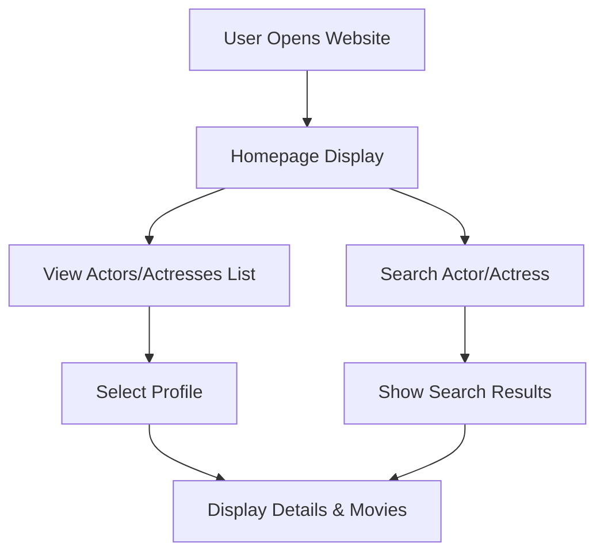

# 🎬 TFI Actors & Actresses Management System

## 📌 Overview

The **TFI Actors & Actresses Management System** is a web-based application designed to manage and display information about Tollywood (Telugu Film Industry) actors and actresses.
The application allows users to explore profiles, view associated movies, and search for specific artists efficiently.

---

## 🚀 Features

* 📋 Actor & actress listing
* 🎥 Movie information display
* 🔍 Search functionality
* 🧾 Profile details view
* 💻 Simple and user-friendly interface

---

## 🛠 Tech Stack

* Frontend: HTML, CSS, JavaScript
* Tools: VS Code, GitHub

---

## 🔄 Application Flow



---

## 📂 Project Structure

```
TFI-Actors-Management/
│── index.html
│── styles/
│   └── style.css
│── scripts/
│   └── script.js
│── assets/
│   ├── images/
│   └── icons/
```

---

## ▶️ How to Run

1. Download or clone the repository
2. Open `index.html` in any web browser
3. Explore the application

---

## 📸 Screenshots

(Add screenshots here)

---

## 📈 Future Improvements

* Backend integration (Spring Boot / Node.js)
* Database support (MySQL)
* Advanced filtering and sorting
* User authentication
* Deployment as a live app

---

## 🎯 Learning Outcomes

* Improved frontend development skills
* Better understanding of UI/UX design
* Experience in structuring web applications

---

## 👨‍💻 Author

**Sai Kumar Masabattula**
GitHub: https://github.com/your-username

---

## ⭐ Acknowledgment

This project was built as part of learning web development and improving practical skills.

